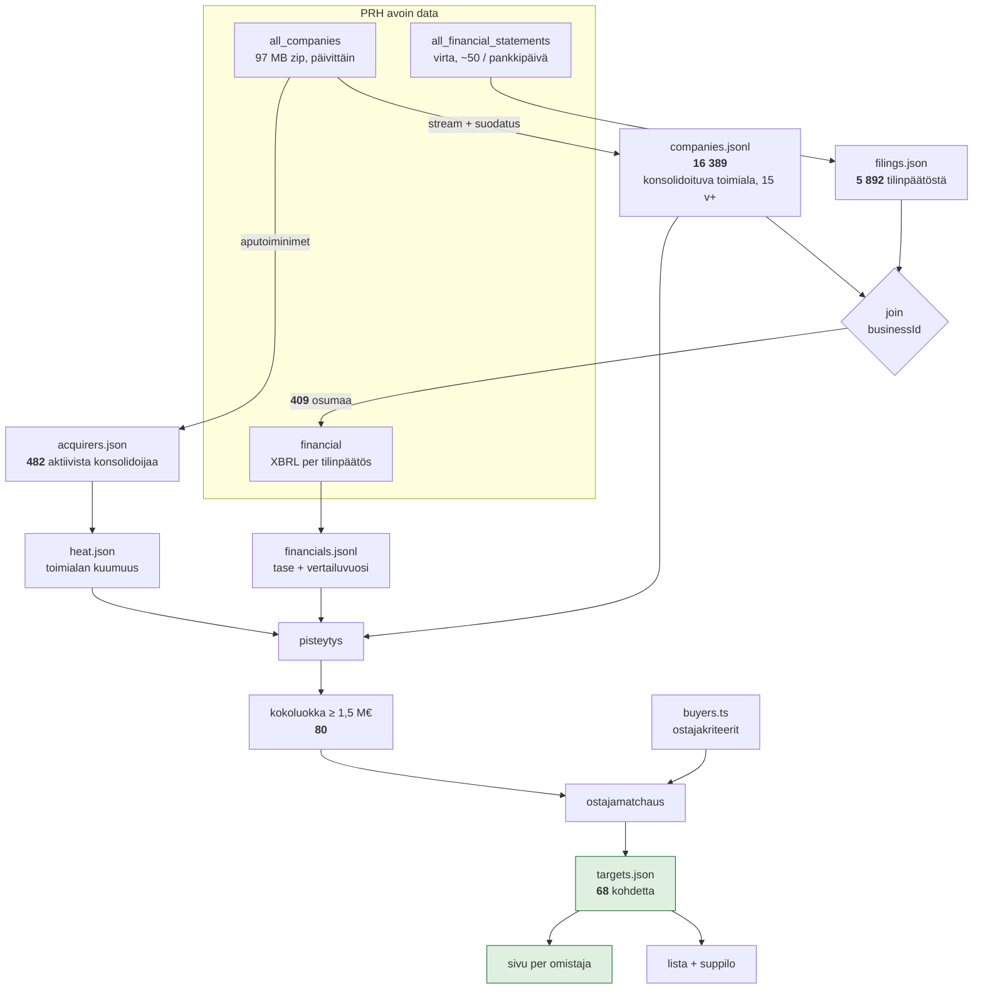
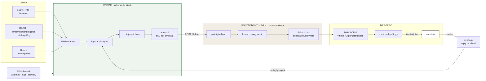
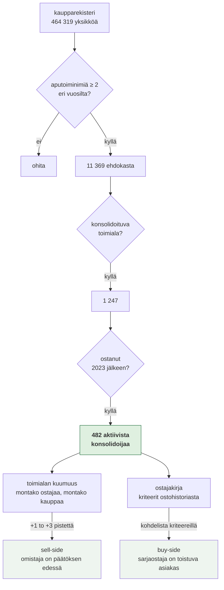

# Dataflow: mitä liikkuu ja mihin

Kolme kaaviota: mitä nyt ajetaan, miten se toimisi tuotannossa Mergerolla, ja mistä ostajakirja
syntyy.

---

## 1. Mitä nyt ajetaan

Huomaa mihin kutsut kohdistuvat. Rekisteri ladataan kerran ja suodatetaan paikallisesti, ja
XBRL haetaan **vain niille 409:lle** jotka läpäisivät suodatuksen. Virrassa on 5 892 tilinpäätöstä,
mutta 5 483 niistä kuuluu yhtiöille jotka eivät ole kohteita. Järjestys on koko tehokkuus.

---

## 2. Miten se toimisi Mergerolla

Kolme asiaa jotka kannattaa lukea kaaviosta:

**Nuoli omistajaan lähtee ihmisestä, ei koneesta.** Kone kirjoittaa luonnoksen, ihminen painaa
lähetä. Tämä ei ole tekninen yksityiskohta vaan se mikä tekee ratkaisusta yhteensopivan heidän
arvonsa kanssa: *Judgment > Automation*.

**Paluunuoli on se joka tekee tästä moottorin eikä ajon.** Kun omistaja vastaa, tieto menee takaisin
pisteytykseen. Kolmen kuukauden jälkeen ei tarvitse arvata mikä signaali toimii.

**Lähdeadapteri on koko skaalautuvuusvastaus.** Signaali on sama joka maassa: julkaisupäivä, ikä,
toimiala, nimi. Suomessa lähde on ilmainen, DACH:ssa ostettu. Mergerolle se on ostopäätös eikä
rakennusprojekti.

---

## 3. Mistä ostajakirja syntyy

Tämä on se osa jota ei tarvinnut tietää etukäteen.

**Miten se toimii.** Kun sarjaostaja ostaa yhtiön ja sulauttaa sen, se rekisteröi ostetun yhtiön
nimen aputoiminimeksi säilyttääkseen brändin. Rekisteröintipäivä jää näkyviin. Kaksi tai useampi
aputoiminimi eri vuosilta on allekirjoitus, jota kukaan ei julkaise ostohistoriana mutta joka on
luettavissa kaikille.

Esimerkki: **PiKa Puhtaus Oy**, joka osti Clean-Kallen Mergeron 2026-kaupassa.

| Aputoiminimi | Rekisteröity |
|---|---|
| Ultra-Palvelu | 2020-05-15 |
| Brahea Palvelut | 2020-11-17 |
| Prine Palvelut | 2021-08-30 |
| Kuopion Siivouspalvelu | 2023-02-20 |

Neljä ostoa, päivämäärineen, ilmaisesta datasta.

**Mitä tästä seuraa.** Sama ajo tuottaa vastauksen molempiin puoliin haastetta:

- **Sell-side:** kun toimialalla on 24 aktiivista ostajaa ja 42 kauppaa kahdessa vuodessa, jokainen
  jäljellä oleva omistaja on päätöksen edessä halusi tai ei. Se on ajoitussignaali joka ei riipu
  siitä onko yhtiö jättänyt sähköistä tilinpäätöstä.
- **Buy-side:** konsolidoija jolla on 260 ostoa on määritelmällisesti toistuva asiakas, ja sille
  voi antaa kohdelistan sen omasta todistetusta kriteeristä. Mergerolla on 2 000 verifioitua
  ostajaa; nämä 482 ovat lisä, eivät korvaaja.

Kuumimmat toimialat tästä ajosta:

| Toimiala | Ostajia | Kauppoja 2023 jälkeen |
|---|---|---|
| Kiinteistöpalvelu | 54 | 118 |
| Tieliikenteen tavarankuljetus | 46 | 71 |
| Sähköasennus | 38 | 67 |
| LVI-asennus | 36 | 131 |
| Kiinteistönhoito | 31 | 106 |
| Erikoislääkäripalvelut | 30 | 247 |
| Kiinteistöjen siivous | 24 | 42 |

---

## Rehellisyys: mitä data ei kerro

- **Aputoiminimi ei aina tarkoita yritysostoa.** Se voi olla oma brändilaajennus. Suodatus vaatii
  kaksi eri vuotta, mikä karsii valtaosan, mutta väärät positiiviset ovat mahdollisia. Siksi
  konsolidaatio antaa enintään kolme pistettä eikä koskaan yksin nosta kohdetta listalle.
- **Sulautuminen ilman nimen säilyttämistä ei näy.** Osa ostoista jää siis löytymättä. Luku 482 on
  alaraja, ei kokonaismäärä.
- **Clean-Kalle ei olisi löytynyt tilinpäätössignaalilla.** Sillä ei ole yhtään digitaalista
  tilinpäätöstä. Se on juuri syy miksi konsolidaatiosignaali on olemassa: se kattaa koko rekisterin,
  ei vain sähköisesti ilmoittavia.
